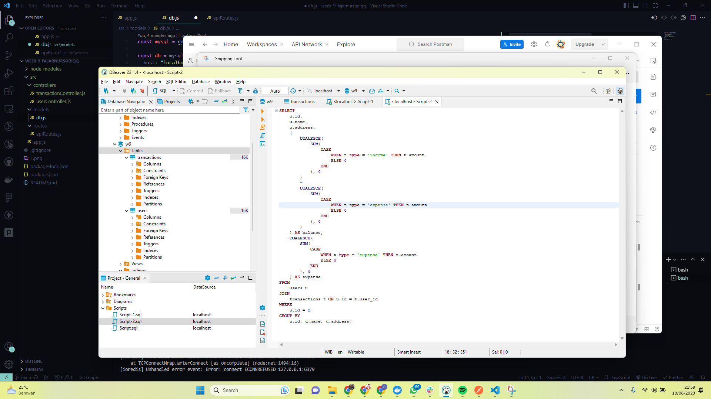
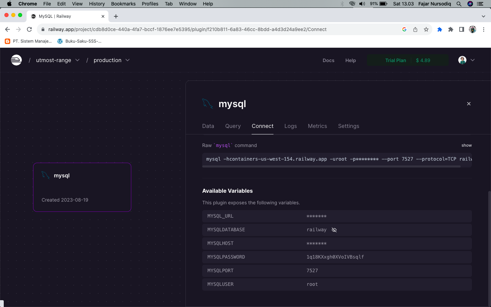
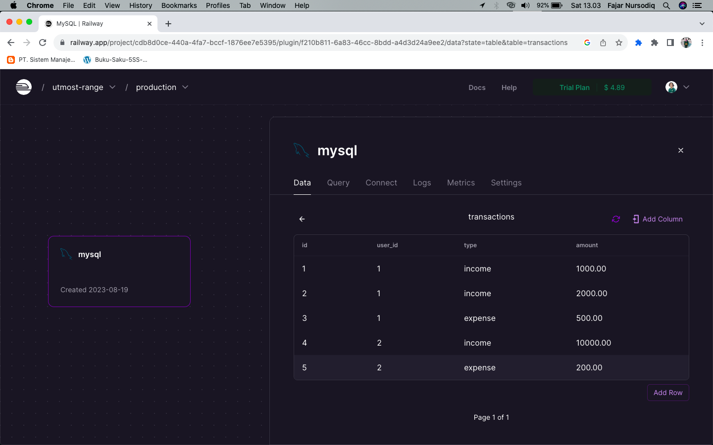
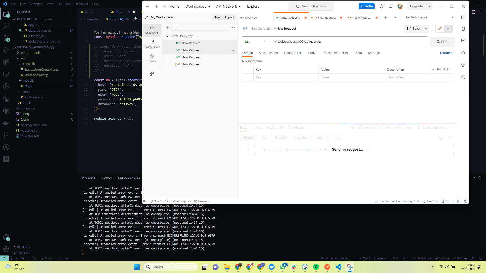
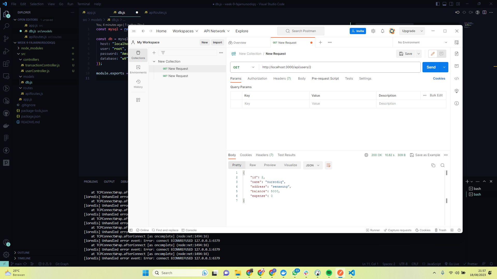

# Express MySQL API

This application provides a simple backend service to manage users and their respective transactions. The data is stored in a MySQL database and exposes several endpoints to interact with the data.

## Stack

- Javascript
- Node.js
- Express.js
- MySQL as Database

- Node.js installed
- MySQL server running

## Creating Database Table

[https://cobalt-blue-nightingale-vest.cyclic.cloud/api/users/1]

